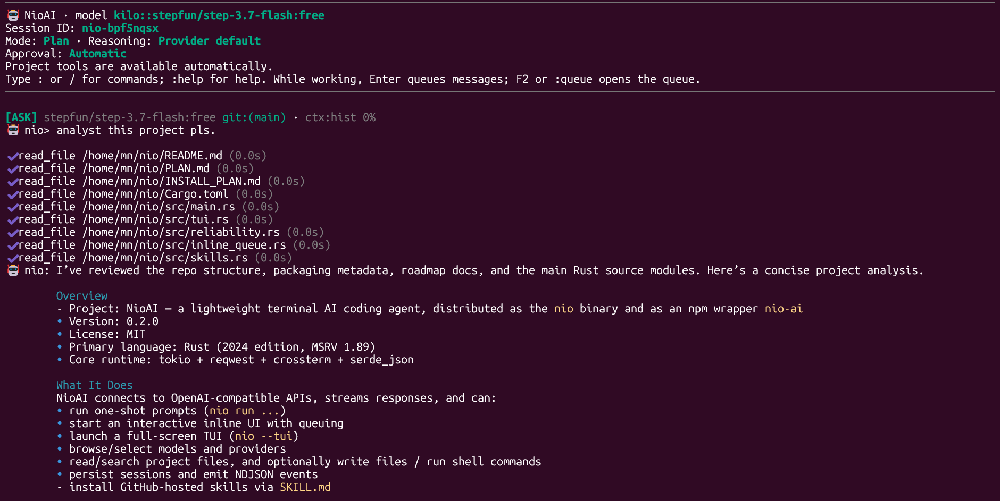
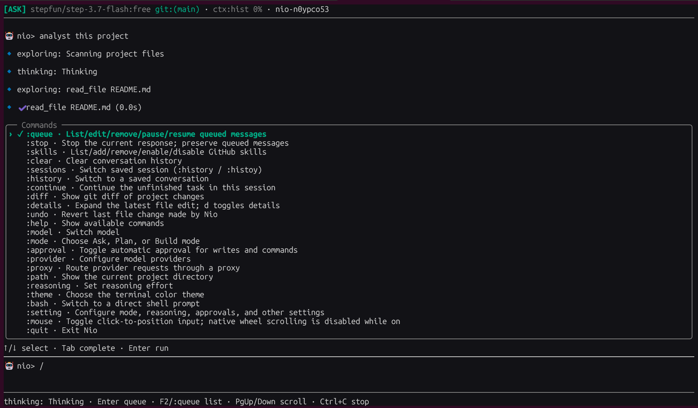

# NioAI

**NioAI is open source software** released under the [MIT License](LICENSE). Contributions, issues, and usage questions are welcome.

NioAI is a lightweight, open source AI coding agent for the terminal. The executable is **`nio`**. It talks to configurable OpenAI-compatible model endpoints. Provider access, model availability, and free quotas depend on the provider and may change.

An older, separate NIO platform also provides a `nio` command. If both are installed, use the full executable path or adjust `PATH`.

Use `nio --version`, `nio -v`, or `nio --v` to print the installed version.

## Requirements

- Rust toolchain to build from source
- Any OpenAI-compatible provider you configure; Kilo is available by default

## Build

```sh
cargo build --release
```

The executable is at `target/release/nio`.

## Install

### Zero-install via npx

If you have Node.js available, launch NioAI instantly with zero manual installation:

```sh
npx @nio-labs/nio-ai
```

Run one-shot prompts or flags directly:

```sh
npx @nio-labs/nio-ai run "Explain this project"
npx @nio-labs/nio-ai models --format json
```

To install globally via npm:

```sh
npm install -g @nio-labs/nio-ai
nio
```

### Shell installer (Linux, macOS, Termux)

Install the pre-built native binary via `curl`:

```sh
curl -fsSL https://raw.githubusercontent.com/nio-labs/nio/main/install.sh | bash
```

Prefer inspecting the script before piping to shell?
```sh
curl -fsSL https://raw.githubusercontent.com/nio-labs/nio/main/install.sh -o install.sh
less install.sh
bash install.sh
```

Custom installation options:
```sh
# Pin a specific version
NIO_VERSION=v0.2.1 curl -fsSL https://raw.githubusercontent.com/nio-labs/nio/main/install.sh | bash

# Custom install path (defaults to ~/.local/bin)
NIO_INSTALL_DIR=~/.local/bin curl -fsSL https://raw.githubusercontent.com/nio-labs/nio/main/install.sh | bash
```

### Windows (PowerShell)

```powershell
irm https://raw.githubusercontent.com/nio-labs/nio/main/install.ps1 | iex
```

See [INSTALL_PLAN.md](INSTALL_PLAN.md) for supported native platform targets and verification plans.

## Quick start

Start the agent. On first launch, Nio fetches models, shows free models first, and saves your choice:

```sh
nio
```

Override the model for one run:

```sh
nio run -m kilo::kilo-auto/free "Explain this project"
```

## Screenshots

Inline CLI showing a project analysis in progress:



Full-screen TUI with the command palette open:



## Queue messages while working

In the inline CLI, a persistent `queue>` input stays available during a response. The agent continues working while you type. Enter queues the message; unfinished drafts stay available when the response completes. Messages run in order after the current task finishes. Queued messages do not enter model context until they run.

- `F2` or `:queue` — open the queue panel; arrows select, Enter/e edits, Delete/d removes, and p pauses/resumes
- `:queue edit 2 New message` — replace a pending message
- `:queue remove 2` / `:queue clear` — remove pending work
- `:queue pause` / `:queue resume` — control automatic processing
- `:stop` — stop the response and preserve pending messages

Queue controls work while a response is running. Other commands entered in the inline queue prompt run after the response; the TUI also supports skill commands during a response. Errors and interruptions pause the queue. Pending messages are kept in memory for the running session.

## GitHub skills

Install a skill folder containing `SKILL.md` from a GitHub repository. Git is required. Local folders are not accepted as installation sources.

```sh
nio --skills
nio --skills add https://github.com/your-org/your-repo path/to/skill
nio skills add https://github.com/your-org/your-repo/tree/main/path/to/skill
nio --skills disable skill-name
nio --skills enable skill-name
nio --skills remove skill-name
```

`nio --skills` defaults to listing installed skills; `nio skills` remains available as an alias. The same operations are available through `:skills` or `/skills` in interactive mode. Installed packages and their enable/disable settings are stored beside the Nio configuration. New installations are enabled by default. The model receives a catalog of enabled skills and can read relevant instructions and supporting text files through `read_skill_file`. Changes affect subsequent requests; skill instructions retain the current mode and approval restrictions.

## Full-screen interface

```sh
nio --tui
nio --tui --session SESSION_ID
```

The optional TUI uses a theme background, a scrollable conversation, and a persistent input area. Enter sends a message when idle and queues it while working. Shift+Enter or Alt+Enter inserts a newline when supported by the terminal. Long pastes use compact markers. Use the mouse wheel/trackpad or Page Up/Down to scroll, and click the input to position the cursor.

`:` and `/` open the command palette. `:setting`, `:mode`, `:model`, `:reasoning`, and `:theme` open selection panels. `:sessions` opens recent saved conversations; `:details` opens the latest diff. Approval prompts use Y/N and D for details. Ctrl+C stops the current work and pauses pending messages. `:quit` saves the session and restores the terminal.

The model picker filters by model name, selector, or provider as you type; Backspace edits the search and Ctrl+U clears it. Arrow navigation updates only changed screen rows.

The theme panel previews each highlighted theme immediately. Enter saves it; Esc restores the saved theme. Available palettes include Tokyo Night and the muted light options Light, Paper, and Cloud.

TUI settings also accept explicit values, such as `:mode build`, `:theme ocean` or `:theme light`, and `:proxy off`. `:provider` displays saved providers; configure provider credentials with `nio provider` in the inline CLI.

## Configure and run

Nio asks whether to trust the current project folder before enabling file access and tools. Trusted folders are remembered. Untrusted non-interactive projects stay locked unless you pass `--trust-project`. In an interactive terminal, Nio still prompts on first access.

Key commands:

- `:clear` — clear the conversation
- `:diff` — review git changes
- `:undo` — revert the last agent file change
- `:quit` — exit
- `:provider` — add or update a provider
- `:mode` — choose Ask, Plan, or Build
- `:models` — browse the model catalog
- `:settings` — inspect and edit saved settings

Presets include OpenRouter, OrcaRouter, AIHubMix, Groq, Cerebras, Gemini, DeepSeek, Together AI, Fireworks, Mistral, SiliconFlow, Anthropic Claude, and OpenAI Codex.

File tools stay inside the current directory. Auto-discovery skips generated folders, secret filenames, and `.gitignore` paths. Individual reads and writes are capped at 512 KiB. Search reads at most 16 MiB and returns at most 50 entries. `.gitignore` parsing is bounded to 256 KiB.

## Sessions and output

Persist and resume conversations with `-s`:

```sh
nio run -s my-chat -m kilo::kilo-auto/free "Check my project"
nio run -s my-chat -m kilo::kilo-auto/free "Now explain the config files"
```

Emit machine-readable events with `--format json`:

```sh
nio run --format json ...
```

See [STREAM.md](STREAM.md) for event shapes and [PROTOCOL.md](PROTOCOL.md) for CLI options, trust behavior, and host integration.

## Settings and config

Common settings:

```sh
nio config list
nio config get model
nio config set theme Monokai
```

Toggle automatic approval for a single run with `--auto`. Set reasoning effort with `:reasoning` or `--reasoning`. Toggle mouse input with `:mouse`. Route traffic through a proxy with `:proxy` or `NIO_PROXY`.

## Privacy

NioAI includes no telemetry, analytics, tracking, or background reporting. Network requests only go to features you use: model discovery, provider checks, and responses. Prompts, conversation context, project files, tool results, and approved command output can be sent to the model endpoint. Review your provider's terms before sending sensitive information. Credentials and sessions are stored locally; on Unix they are restricted to your user account. Avoid putting API keys directly in shell history.

## NioDE integration

NioAI is available as the `nio` agent through NioDE's direct subprocess route. Install a current native `nio` executable on the server's `PATH`; Nio does not require npm or a persistent agent server. Automatic installation awaits published, verified native release artifacts.

The Chat UI requests project access before enabling Nio tools. Build consent also grants file edits and shell execution for that conversation/project. Ask and Plan are enforced as read-only. Studio uses `--mode ask --no-tools`; it receives generated text and owns its file writes.

For another host, the explicit interface is:

```sh
nio models --format json
nio run -m kilo::kilo-auto/free --format json --mode ask --reasoning low \
  --trust-project --dir /path/to/project -s project-chat -- "Explain this project"
```

`--trust-project` grants project reads for this invocation. `--no-tools` disables all project discovery and tools, even for remembered trusted folders. `--auto` grants writes and shell commands for a single invocation; noninteractive runs ignore saved automatic approval preferences. Approved commands have the current user's host access; the project directory is their starting directory, not a shell sandbox. `NIO_API_KEY` overrides credentials for the selected chat provider and is not broadcast to model catalogs. Catalogs use provider-specific saved or environment credentials. `--reasoning` accepts low, medium, high, or default. `--file PATH` attaches a UTF-8 text file or a PNG, JPEG, GIF, or WebP image. In prompts, use `@path` or `@{path with spaces}` to attach an existing file; in the regular interactive prompt and `--tui`, an existing absolute path pasted or dropped into the prompt is also attached automatically. `read_file` can read a specific absolute local path when you ask about it, including image files; project-relative reads remain project-scoped. Dropping a supported file into the TUI composer inserts a path reference. Text attachments share a 24 KiB prompt limit; image files may be up to 10 MiB each and 20 MiB total. Images require a vision-capable provider model. PDF and other binary documents are not supported yet.

JSON runs emit a `session` event with `sessionID` immediately, and persist the conversation on completion or handled interruption. Sessions are bound to the canonical project directory and project-access scope, with a lock preventing simultaneous use. Old array-only sessions have no project binding and require starting a new session; their files are preserved.

## Resource and reliability limits

- File tools reject excluded directories, parent traversal, and symlinks. Discovery visits at most 10,000 entries, to depth 8. Individual reads/writes remain capped at 512 KiB; search reads at most 16 MiB and returns at most 50 bounded snippets. Discovery reads at most 256 KiB of `.gitignore` rules and applies common glob, directory, anchoring, and negation patterns.
- HTTP connections have a 10-second deadline; reads have a 60-second inactivity deadline; requests have a 300-second total deadline. Catalog requests have a 15-second deadline. Transient connection failures and HTTP 429/502/503/504 receive at most three retries with backoff and jitter before response delivery.
- A turn permits 128 model steps and at most 16 tool calls per response. When the step budget is reached, Nio asks the provider to summarize progress and tells you how to continue. Response text is capped at 2 MiB, individual stream events and tool arguments at 1 MiB, and some internal reads allow up to 8 MiB. Incomplete responses cannot execute tools.
- Context uses a 512 KiB serialized-message budget and drops whole older user turns, preserving tool-call/result groups. This is a byte budget, not an exact tokenizer or a guarantee for every provider's context window. A turn stops with a clear error when it reaches the budget.
- Files, config, and sessions use synced temporary files and atomic replacement. Writes preview changed lines and reject stale content. Config and session files are private on Unix. Locks prevent simultaneous Nio saves; external editors do not participate in these locks.
- Shell commands use a 120-second deadline and bounded captured output. On Unix, shell process groups are killed on completion, timeout, or handled cancellation, and the shell is reaped. Hosts should send SIGTERM and allow cleanup before forcing termination. Native Windows shell support remains pending.
- Follow-up suggestions are off by default to avoid an extra model request.

## Repository

- Language: Rust
- Default provider: Kilo
- Repository: https://github.com/nio-labs/nio
- License: [MIT](LICENSE)
